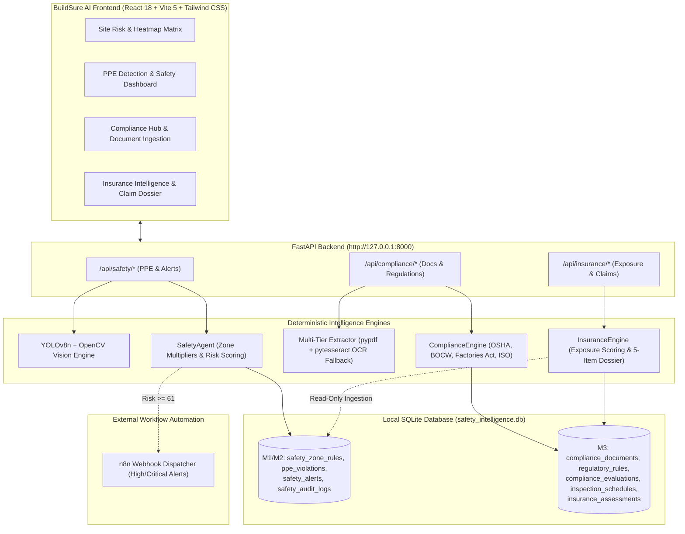

# BuildSure AI — Agentic Construction Risk Intelligence Platform 🏗️🤖

> **Infosys Springboard Internship Project**  
> *Autonomous Multi-Agent AI Ecosystem for Real-Time Safety Monitoring, Worker PPE Intelligence, Site Hazard Detection, Regulatory Compliance, and Construction Insurance Analytics.*

---

## 🚀 Overview & Uniqueness (Why BuildSure AI Stands Out)

Construction sites are high-risk, dynamic environments where traditional manual safety inspections, delayed incident reporting, and fragmented compliance audits fail to prevent catastrophic accidents. 

**BuildSure AI** redefines construction risk management by introducing an **Agentic Multi-AI Ecosystem** that operates as an autonomous risk intelligence layer across construction sites. Instead of static dashboards or basic rule engines, BuildSure AI deploys specialized, collaborating AI Agents that continuously ingest site data, compute multi-factor risk scores, predict hazard escalations, evaluate PPE compliance via YOLO vision, assess multi-jurisdiction regulatory compliance against site documents, and calculate insurance exposure analytics with audit-ready claim dossiers.

### 🌟 Milestone Release Status
- ✅ **Milestone 1**: Site Risk Monitoring & Hazard Detection Core (**Operational**)
- ✅ **Milestone 2**: Functional Hybrid PPE Safety Prototype with YOLOv8n person detection, OpenCV heuristic fallback, SafetyAgent PPE association, SQLite persistence, and n8n webhook automation (**Operational & Frozen**)
  > *"Functional hybrid PPE safety prototype; PPE-specific YOLO fine-tuning and held-out validation are planned future enhancements."*
- ✅ **Milestone 3**: Compliance & Insurance Intelligence MVP (**Complete & Fully Integrated**)

---

## 🏗️ Multi-Agent Ecosystem Architecture & Data Flow



---

## 🛠️ Key Features by Milestone

### Milestone 1: Site Risk Monitoring Core
1. **Autonomous Site Risk Agent (`SiteRiskAgent.js`)**: Multi-factor risk scoring ($P \times I \times E$ + Weighted formula).
2. **Interactive Spatial Site Map (`SiteMapGrid.jsx`)**: 2D zone risk status, worker count, sensor feeds.
3. **5x5 Risk Heatmap Matrix (`RiskHeatmapMatrix.jsx`)**: Probability vs Impact heatmap matrix.
4. **Live Hazard Detection Panel (`HazardDetectionPanel.jsx`)**: Hazard filtering & XAI decision traces.

### Milestone 2: Safety Intelligence & Worker Protection (Hybrid Prototype)
1. **Python FastAPI Backend (`/backend`)**: OpenCV visualization, SQLite database via SQLAlchemy.
2. **Ultralytics YOLO Vision Detector (`yolo_detector.py`)**: Detects workers, helmets, vests with confidence scoring.
3. **Autonomous `SafetyAgent` Engine (`safety_agent.py`)**:
   - Head region matching (upper 35% bounding box) for helmets.
   - Torso region matching (middle 40% bounding box) for safety vests.
   - Construction zone rules (General, Excavation, Vehicle, Electrical, Work-at-Height) with risk multipliers ($1.0\times$ to $1.5\times$).
   - Safety risk score formula: $\text{risk\_score} = \min(100, \text{round}(\text{base\_score} \times \text{zone\_multiplier}))$.
   - Low-confidence detections flagged as `needs_human_review`.
4. **Interactive PPE Detection Page (`PPEDetectionPage.jsx`)**: Upload site photos, select work zones, view side-by-side YOLO annotated results.
5. **Safety Intelligence Dashboard (`SafetyDashboardPage.jsx`)**: Live KPI metrics, PPE compliance rates, distribution charts, stored database records.
6. **Safety Alerts & Audit History (`SafetyAlertsPage.jsx`)**: Supervisor alert acknowledge & resolve workflows with audit logs.
7. **n8n Workflow Automation Integration (`n8n_dispatcher.py`)**: Asynchronous, fail-safe webhook notifications for High/Critical risk alerts (`risk_score >= 61`), delivery channel audit logs, and retry endpoints ([Read Full Guide](file:///c:/Users/Dhanusri/Downloads/Infosys/infosys-springboard-safety-ai/docs/n8n-milestone-2-integration.md)).

### Milestone 3: Compliance & Insurance Intelligence MVP
1. **Multi-Tier Document Ingestion Engine (`document_extractor.py`)**:
   - Native PDF text extraction via `pypdf` (100% local, zero paid cloud APIs).
   - Scanned image / OCR fallback via `pytesseract`.
   - Graceful fallback: If Tesseract OCR is not installed on the system, the application degrades safely to `ocr_unavailable` / `needs_human_review` without crashing.
   - Secure sanitized file naming (`doc_{uuid8}_{timestamp}_{name}`) and 15MB size limit.
2. **Deterministic Regulatory Rule Matcher (`compliance_engine.py`)**:
   - Reference standards across OSHA 1926, Indian BOCW Central Rules 1998, Factories Act 1948, and ISO 45001.
   - Categorizes evidence into 4 explicit statuses: `compliant`, `non_compliant`, `missing_evidence`, and `needs_human_review`.
   - Exact page citation and section header matching (`evidence_page`, `evidence_section`, `evidence_snippet`).
   - Supervisor review gateway with audit overrides.
   - Dynamic inspection & certificate renewal scheduler with `UPCOMING`, `DUE_SOON`, and `OVERDUE` badges.
   - Exportable structured JSON compliance audit reports.
3. **Insurance Exposure & Claim Adjudication Engine (`insurance_engine.py`)**:
   - Read-only ingestion of SQLite safety records.
   - Calculates site exposure risk score (0–100) and maps to 5 exposure tiers (`NEGLIGIBLE`, `LOW`, `MODERATE`, `HIGH`, `CATASTROPHIC`).
   - Generates 5-item claim dossier checklists (Visual Telemetry, Supervisor Audit Trail, Zone Rule Reference, Worker Induction, Resolution Sign-Off).
   - Supervisor claim adjudication modal with separate legal counsel policy gate.
   - Permanent disclaimers protecting against misinterpretation as actual insurance policies or legal approvals.

---

## ⚡ API Endpoints Summary

### Milestone 1 & 2: Safety & Alerts Endpoints (`/api/safety/*`)
| Endpoint | Method | Description |
| :--- | :---: | :--- |
| `/health` | `GET` | System health check (DB status, YOLO model status, backend health) |
| `/api/safety/analyze-image` | `POST` | Upload image + zone -> YOLO inference + SafetyAgent evaluation + DB record + n8n dispatch |
| `/api/safety/violations` | `GET` | List stored PPE violations with zone/severity/status filters |
| `/api/safety/summary` | `GET` | Aggregate safety analytics (compliance rates, score, trend) |
| `/api/safety/alerts` | `GET` | List generated safety alerts with evidence URLs & audit logs |
| `/api/safety/alerts/{id}/acknowledge` | `POST` | Acknowledge alert with audit trail entry |
| `/api/safety/alerts/{id}/resolve` | `POST` | Resolve alert with resolution note & audit record |
| `/api/safety/alerts/{id}/automation-status` | `POST` | Update n8n automation delivery status (secured via `X-N8N-Secret`) |
| `/api/safety/alerts/{id}/retry-automation` | `POST` | Re-dispatch automation webhook for High/Critical alert |

### Milestone 3: Compliance Endpoints (`/api/compliance/*`)
| Endpoint | Method | Description |
| :--- | :---: | :--- |
| `/api/compliance/documents/upload` | `POST` | Upload PDF/image document for text extraction & rule evaluation |
| `/api/compliance/documents` | `GET` | List uploaded compliance documents |
| `/api/compliance/regulations` | `GET` | List regulatory reference standards from knowledge base |
| `/api/compliance/evaluations` | `GET` | List rule evaluations with page citations and evidence snippets |
| `/api/compliance/evaluations/{id}/review` | `POST` | Record supervisor review override on rule evaluation |
| `/api/compliance/schedules` | `GET` / `POST` | List or create inspection/renewal due-date schedules |
| `/api/compliance/report` | `GET` | Export structured JSON compliance audit report |

### Milestone 3: Insurance Endpoints (`/api/insurance/*`)
| Endpoint | Method | Description |
| :--- | :---: | :--- |
| `/api/insurance/exposure-summary` | `GET` | Aggregate safety records into exposure score (0-100) & risk tier |
| `/api/insurance/claims` | `GET` | List incident claim assessments with 5-item dossier checklists |
| `/api/insurance/claims/{id}/human-review` | `POST` | Record supervisor adjudication (`APPROVED_FOR_FILING` / `REJECTED`) |

---

## 💻 Quick Start & Running Locally

### 1. Prerequisites
- **Node.js**: v18+ (tested on v20+)
- **Python**: 3.10+ (tested on Python 3.11)
- **Tesseract OCR (Optional)**: For scanned image OCR. If not installed, native PDF extraction operates normally and image scans degrade safely to `needs_human_review`.
  - *Windows*: Download from [UB-Mannheim Tesseract OCR](https://github.com/UB-Mannheim/tesseract/wiki) and add to PATH.
  - *Linux*: `sudo apt-get install tesseract-ocr`
  - *macOS*: `brew install tesseract`

### 2. Start Python FastAPI Backend

```powershell
# Navigate to project root
cd infosys-springboard-safety-ai

# (Optional) Seed baseline regulatory rules & schedules
.\venv\Scripts\python.exe backend\seed_compliance_rules.py

# Run FastAPI backend server with auto-reload
.\venv\Scripts\python.exe backend\run_server.py
```
*Backend runs at `http://127.0.0.1:8000`*
- **Health Endpoint**: `http://127.0.0.1:8000/health`
- **Interactive Swagger Docs**: `http://127.0.0.1:8000/docs`

### 3. Start React Frontend

```powershell
# Open a new terminal in project root
cd infosys-springboard-safety-ai

# Install node dependencies
npm install

# Start Vite dev server
npm run dev
```
*Frontend runs at `http://localhost:5173`.*

---

## ⚙️ Environment Configuration (`.env`)

```env
# YOLO Vision & Confidence Thresholds
YOLO_MODEL_PATH=yolov8n.pt
YOLO_CONFIDENCE_THRESHOLD=0.70

# Database Configuration
DATABASE_URL=sqlite:///./safety_intelligence.db
BACKEND_HOST=127.0.0.1
BACKEND_PORT=8000

# Frontend & Webhook Integrations
FRONTEND_URL=http://localhost:5173
N8N_SAFETY_WEBHOOK_URL=
```

---

## 🔒 Safety, Privacy & Disclaimers

1. **No Face Recognition or PII**: All worker tags use anonymous spatial labels (`Worker-01`, `Worker-02`).
2. **Compliance Disclaimer**:
   > *"Automated AI Assessment — Reference Rule Match — Requires Qualified Safety Supervisor Review. Not a legal or regulatory certification."*
3. **Insurance Decision-Support Disclaimer**:
   > *"Internal safety decision-support estimate only. Does not represent actual insurance policy terms, premiums, or claim settlements."*
4. **Liability Ranges**:
   > *"Illustrative internal estimate — not an insurance quotation or claim value."*
5. **Supervisor Adjudication Status**:
   > *"Internal supervisor workflow — not legal approval."*
6. **Data Privacy**:
   - Uploaded files and database files (`*.db`, `uploads/`, `documents/`) are strictly excluded from version control via `.gitignore`.
   - Zero external paid cloud AI APIs are used; all text processing and inference execute locally.

---

## 📚 Technical Documentation & Evaluation Guides

- [Milestone 3 Evaluation & Architecture Report](file:///c:/Users/Dhanusri/Downloads/Infosys/infosys-springboard-safety-ai/docs/milestone-3-evaluation.md)
- [Milestone 3 Test & Verification Checklist](file:///c:/Users/Dhanusri/Downloads/Infosys/infosys-springboard-safety-ai/docs/milestone-3-test-checklist.md)
- [Milestone 3 API Contract Specification](file:///c:/Users/Dhanusri/Downloads/Infosys/infosys-springboard-safety-ai/docs/api-compliance-insurance.md)
- [Milestone 2 Evaluation & Prototype Architecture](file:///c:/Users/Dhanusri/Downloads/Infosys/infosys-springboard-safety-ai/docs/milestone-2-evaluation.md)
- [Milestone 2 n8n Webhook Integration Guide](file:///c:/Users/Dhanusri/Downloads/Infosys/infosys-springboard-safety-ai/docs/n8n-milestone-2-integration.md)
- [PPE Model Training Guide (Planned Enhancement)](file:///c:/Users/Dhanusri/Downloads/Infosys/infosys-springboard-safety-ai/docs/ppe-model-training.md)
- [PPE Model Validation Guide (Planned Enhancement)](file:///c:/Users/Dhanusri/Downloads/Infosys/infosys-springboard-safety-ai/docs/ppe-model-validation.md)

---

© 2026 BuildSure AI Team. Developed for Infosys Springboard Internship Program.
