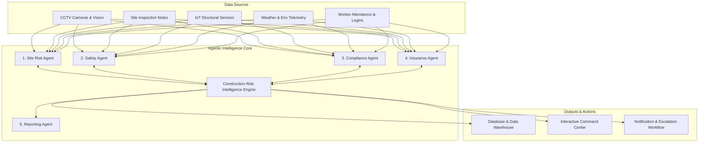
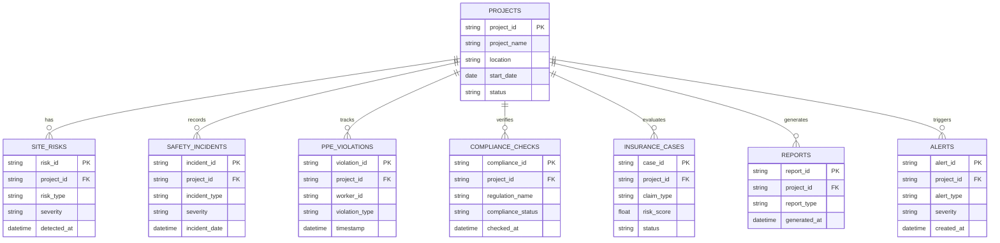

# BuildSure AI — Agentic Construction Risk Intelligence Platform 🏗️🤖

> **Infosys Springboard Internship Project**  
> *Autonomous Multi-Agent AI Ecosystem for Real-Time Safety Monitoring, Site Hazard Detection, Regulatory Compliance, and Construction Risk Analytics.*

---

## 🚀 Overview & Uniqueness (Why BuildSure AI Stands Out)

Construction sites are high-risk, dynamic environments where traditional manual safety inspections, delayed incident reporting, and fragmented compliance audits fail to prevent catastrophic accidents. 

**BuildSure AI** redefines construction risk management by introducing an **Agentic Multi-AI Ecosystem** that operates as an autonomous risk intelligence layer across construction sites. Instead of static dashboards or basic rule engines, BuildSure AI deploys specialized, collaborating AI Agents that continuously ingest site data, compute multi-factor risk scores, predict hazard escalations, automate regulatory compliance, and orchestrate mitigation workflows.

### 🌟 What Makes BuildSure AI Unique? (Industry Differentiators)

1. **Autonomous 5-Agent Collaborative Network**: Dedicated agents (Site Risk, Worker Safety, Compliance, Insurance, Reporting) that autonomously exchange contextual alerts and trigger proactive recommendations.
2. **Interactive Spatial Site Map & Risk Heatmap Grid**: Visual 2D/3D spatial mapping of construction site zones (Excavation, Tower Crane, Scaffolding, Electrical Grid) with real-time hazard markers and dynamic risk density overlays.
3. **Multi-Factor Explainable Risk Scoring Engine (XAI)**: Risk scoring based on a multi-dimensional matrix:
   $$\text{Risk Score} = (\text{Probability} \times \text{Severity} \times \text{Exposure}) \times \text{Environmental Multiplier}$$
   Provides full transparent visual reasoning traces for every AI recommendation.
4. **Real-time Live Telemetry & Event Simulator**: Ingestion simulation of weather parameters (wind speed, heat index), IoT structural vibration sensors, worker density feeds, and CCTV event triggers.
5. **Agent Decision Trace Visualizer**: Live UI drawer rendering the inner step-by-step reasoning, tool execution, and confidence metrics of the AI agents.
6. **Executive & Operational Glassmorphic Dashboard**: A state-of-the-art dark-mode command center built with React, Vite, Tailwind CSS, and Chart.js.

---

## 🎯 Problem Statement & Outcomes

### Problem Statement
Construction projects face significant risks involving worker safety, site hazards, regulatory non-compliance, insurance liability, and operational delays. Site managers rely on manual inspections and delayed audits, making it difficult to proactively identify risks before incidents occur.

### Expected Outcomes
- **AI-Powered Construction Risk Detection**: Proactive identification of hazards before accidents happen.
- **Proactive Safety Hazard Identification**: Real-time alerts on environmental, equipment, and structural risks.
- **Automated Compliance Monitoring**: Automated verification against OSHA, ISO, and regional safety regulations.
- **Insurance Risk Assessment & Claims Intelligence**: Quantitative risk scoring to reduce insurance premiums and simplify claim verification.
- **Site Risk Scoring & Prioritization**: Automated priority ranking of high-risk site zones.
- **Automated Incident & Audit Reporting**: Instant generation of executive summaries and audit-ready reports.
- **Real-Time Construction Risk Dashboard**: Executive-level visibility across single or multiple construction projects.

---

## 🏗️ Multi-Agent Ecosystem Architecture

BuildSure AI employs 5 specialized AI Agents managed by the **Construction Risk Intelligence Engine**:



### Agent Responsibilities

| Agent Module | Primary Functionality & Capabilities |
| :--- | :--- |
| **1. Site Risk Agent** | • Monitors site activities & structural conditions<br>• Detects environmental risks (wind, heat, vibration)<br>• Identifies heavy equipment hazards<br>• Computes zone-level site risk scores |
| **2. Safety Agent** | • Monitors worker safety compliance & PPE usage<br>• Detects restricted area entry & fall hazards<br>• Analyzes accident-prone zones<br>• Generates proactive safety recommendations |
| **3. Compliance Agent** | • Validates OSHA & regional regulatory compliance<br>• Detects building code & policy violations<br>• Tracks mandatory safety inspection deadlines<br>• Generates compliance readiness reports |
| **4. Insurance Agent** | • Assesses overall project insurance exposure<br>• Evaluates incident severity & financial risk<br>• Analyzes claim risk factors & probability<br>• Supports automated claim documentation |
| **5. Reporting Agent** | • Aggregates findings from all 4 specialized agents<br>• Generates daily site activity reports & executive summaries<br>• Produces audit-ready compliance documentation |

---

## 📊 Database Schema

BuildSure AI utilizes a relational architecture optimized for high-speed risk queries and multi-agent event correlation:



---

## 🗓️ Week-Wise Milestone Roadmap

BuildSure AI is developed incrementally across 4 key milestones (8 Weeks):

```
┌─────────────────────────────────────────────────────────────────────────────────────────┐
│ MILESTONE 1 (Weeks 1–2): Site Risk Monitoring & Hazard Detection [CURRENT RELEASE]      │
│ • Build Site Risk Agent core logic & scoring engine                                     │
│ • Integrate simulated site monitoring data & IoT telemetry                              │
│ • Develop hazard detection workflows & probability-impact risk matrix                   │
│ • Create live interactive Site Risk Monitoring Dashboard                                │
└─────────────────────────────────────────────────────────────────────────────────────────┘
                                           │
                                           ▼
┌─────────────────────────────────────────────────────────────────────────────────────────┐
│ MILESTONE 2 (Weeks 3–4): Safety Intelligence & Worker Protection                        │
│ • Build Safety Agent & worker behavior monitor                                          │
│ • Implement PPE compliance detection module                                             │
│ • Develop high-risk worker proximity alerts & accident-prone zone heatmap               │
│ • Build Safety Analytics Dashboard                                                      │
└─────────────────────────────────────────────────────────────────────────────────────────┘
                                           │
                                           ▼
┌─────────────────────────────────────────────────────────────────────────────────────────┐
│ MILESTONE 3 (Weeks 5–6): Compliance & Insurance Intelligence                            │
│ • Build Compliance Agent & OSHA regulatory validation workflows                         │
│ • Build Insurance Agent & claim risk severity estimator                                 │
│ • Develop automated compliance reporting & audit readiness scores                       │
│ • Build Compliance & Insurance Dashboard                                                │
└─────────────────────────────────────────────────────────────────────────────────────────┘
                                           │
                                           ▼
┌─────────────────────────────────────────────────────────────────────────────────────────┐
│ MILESTONE 4 (Weeks 7–8): Reporting Intelligence & Enterprise Deployment                 │
│ • Build Reporting Agent & Construction Risk Intelligence Engine                         │
│ • Integrate cross-agent orchestration & executive command center                        │
│ • Implement multi-channel alert dispatcher (Email, SMS, Teams/Slack)                    │
│ • Final system integration & production deployment                                      │
└─────────────────────────────────────────────────────────────────────────────────────────┘
```

---

## 🏆 Evaluation Criteria Matrix

| Milestone | Key Deliverables | Status |
| :--- | :--- | :---: |
| **Milestone 1 (Week 2)** | • Site risk monitoring operational<br>• Hazard detection functioning<br>• Site risk dashboard available | ✅ **Completed** |
| **Milestone 2 (Week 4)** | • PPE detection operational<br>• Safety alerts generated<br>• Worker safety analytics functional | ⏳ Scheduled |
| **Milestone 3 (Week 6)** | • Compliance validation operational<br>• Insurance risk assessments generated<br>• Regulatory reporting available | ⏳ Scheduled |
| **Milestone 4 (Week 8)** | • End-to-end platform deployed<br>• Executive dashboards operational<br>• Risk intelligence engine functional<br>• Automated reporting supported | ⏳ Scheduled |

---

## 🛠️ Week 1 Feature Breakdown & Implementation

In **Milestone 1**, we have built the **Site Risk Monitoring & Hazard Detection Core**:

### Key Components Implemented in Week 1:
1. **Autonomous Site Risk Agent (`SiteRiskAgent.js`)**:
   - Ingests site condition logs, weather data, and equipment vibration feeds.
   - Calculates site risk scores using multi-factor probability vectors.
   - Identifies active hazards (Fall risks, Heavy equipment proximity, Deep excavation instability, Electrical exposure).
   - Generates AI reasoning traces and contextual mitigation recommendations.
2. **Interactive Site Map Spatial Grid (`SiteMapGrid.jsx`)**:
   - 2D layout of active site zones (Zone A: Excavation, Zone B: Tower Crane, Zone C: Scaffolding, Zone D: Materials).
   - Real-time zone risk status badges, active worker counts, and sensor telemetry overlay.
3. **5x5 Inherent vs. Residual Risk Matrix (`RiskHeatmapMatrix.jsx`)**:
   - Dynamic 5x5 Probability vs. Impact heatmap matrix auto-computed from active hazards.
4. **Live Hazard Detection Panel (`HazardDetectionPanel.jsx`)**:
   - Filtering by hazard type (Fall, Equipment, Electrical, Environmental).
   - Instant trigger inspection and AI recommendation expansion.
5. **Real-time Telemetry & Risk Simulator (`SimulatorControls.jsx`)**:
   - Interactive button controls to simulate site events (e.g. High Wind Warning, Crane Vibration Anomaly, Excavation Trench Shift) and observe real-time agent recalculation.
6. **Agent Decision Trace Drawer (`AgentReasoningDrawer.jsx`)**:
   - Full explainability panel detailing how the AI agent reached its risk score.

---

## 💻 Quick Start & Running Locally

### Prerequisites
- **Node.js**: `v18.0.0` or higher
- **npm**: `v9.0.0` or higher

### Installation Steps

1. **Clone the repository**:
   ```bash
   git clone https://github.com/your-username/infosys-springboard-safety-ai.git
   cd infosys-springboard-safety-ai
   ```

2. **Install dependencies**:
   ```bash
   npm install
   ```

3. **Start the development server**:
   ```bash
   npm run dev
   ```
   Open your browser at `http://localhost:5173`.

4. **Build for production**:
   ```bash
   npm run build
   ```

---

## 📄 License & Infosys Internship Attribution

This project is developed as part of the **Infosys Springboard Internship Program** for the topic **Agentic AI for Safety Monitoring with Construction Risk Analytics**.

© 2026 BuildSure AI Team. All rights reserved.
