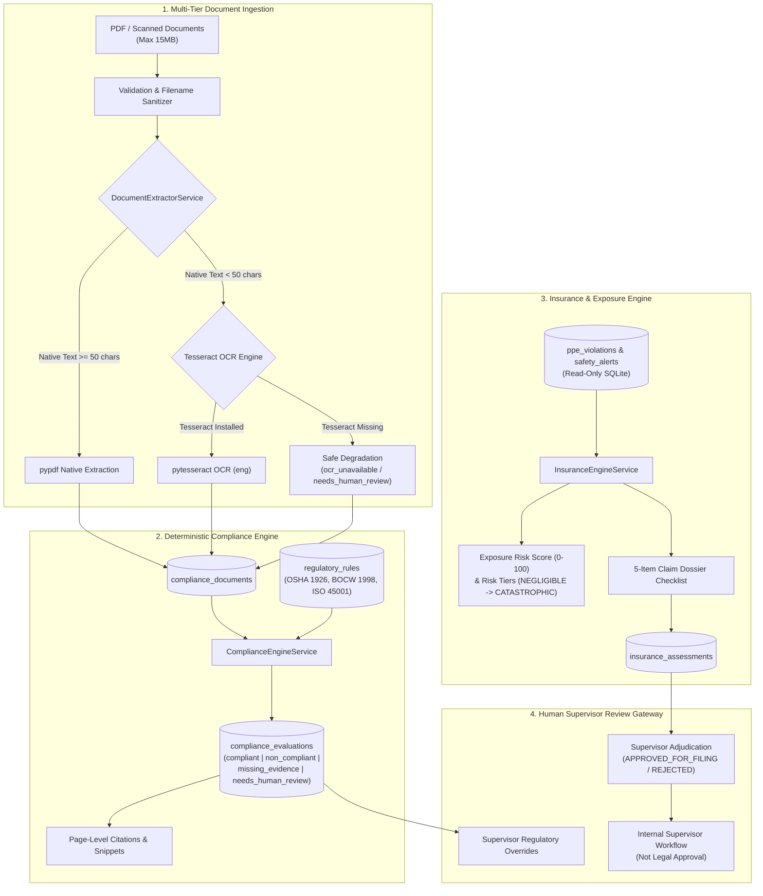

# BuildSure AI — Milestone 3 Evaluation & Architecture Report

## 1. Milestone Status Summary
- **Milestone 1**: Multi-Agent Safety Command Center & Site Risk Simulation (**Operational**).
- **Milestone 2**: Functional Hybrid PPE Safety Prototype with YOLOv8n person detection, OpenCV heuristic fallback, SafetyAgent PPE association, SQLite persistence, and n8n webhook automation (**Operational & Frozen**).
  > *"Functional hybrid PPE safety prototype; PPE-specific YOLO fine-tuning and held-out validation are planned future enhancements."*
- **Milestone 3**: Compliance & Insurance Intelligence MVP (**Complete & Fully Integrated**).

---

## 2. Architecture & Data Flow

---

## 3. Technology Stack & Local Execution

| Component | Library / Tool | License / Type | Cost |
|---|---|---|---|
| **Backend Framework** | FastAPI + Uvicorn | BSD-3 (Local Python) | $0.00 |
| **Database** | SQLite + SQLAlchemy 2.0 | Public Domain | $0.00 |
| **PDF Extraction** | `pypdf` (v6.13.3) | BSD-3 (Pure Python) | $0.00 |
| **Scanned OCR** | `pytesseract` (v0.3.13) + Tesseract OCR | Apache 2.0 (Local CPU) | $0.00 |
| **Date & Text Parsing** | `python-dateutil` + Regex | Apache 2.0 / PSF | $0.00 |
| **Frontend Framework** | React 18 + Vite 5 + TailwindCSS | MIT | $0.00 |
| **Icons & UI** | Lucide React | ISC | $0.00 |
| **External Paid APIs** | **None** (Zero Grok / OpenAI / Anthropic) | N/A | $0.00 |

---

## 4. Key Capabilities & Deliverables

1. **Deterministic Regulatory Rule Engine**:
   - Matches construction policies and equipment certificates against OSHA 1926, Indian BOCW Rules 1998, Factories Act 1948, and ISO 45001 standards.
   - Categorizes findings into 4 explicit statuses: `compliant`, `non_compliant`, `missing_evidence`, and `needs_human_review`.
   - Records exact page numbers (`evidence_page`) and section headers.
2. **Safe OCR Degradation**:
   - If Tesseract is not installed on Windows, native `pypdf` continues operating normally while image-based scans are flagged as `needs_human_review` without crashing.
3. **Insurance Exposure & Claim Dossier Checklist**:
   - Reads SQLite safety records in a read-only manner.
   - Calculates exposure score (0–100) and maps to 5 exposure tiers (`NEGLIGIBLE`, `LOW`, `MODERATE`, `HIGH`, `CATASTROPHIC`).
   - Automatically builds a 5-item documentation readiness checklist.
4. **Human-in-the-Loop Review**:
   - Requires supervisor identity and audit notes before any claim status can be updated to `APPROVED_FOR_FILING`.
   - Clear policy gate separating optional legal counsel sign-off from supervisor internal workflow.

---

## 5. Disclaimers & Regulatory Transparency

- **Compliance**: *"Automated AI Assessment — Reference Rule Match — Requires Qualified Safety Supervisor Review. Not a final legal or regulatory certification."*
- **Insurance**: *"Internal safety decision-support estimate only. Does not represent actual insurance policy terms, premiums, or claim settlements."*
- **Liability Ranges**: *"Illustrative internal estimate — not an insurance quotation or claim value."*
- **Workflow Status**: *"Internal supervisor workflow — not legal approval."*
