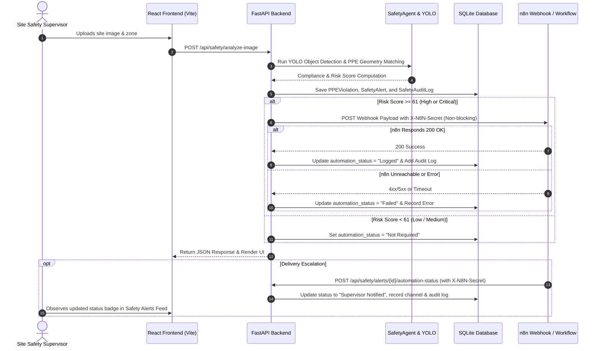

# BuildSure AI — n8n Workflow Integration Guide (Milestone 2) 🤖⚡

> **Architecture Documentation & Integration Manual**  
> *Autonomous notification, escalation, and delivery management for High and Critical PPE safety alerts.*

---

## 🏗️ Architecture & Flow Overview

BuildSure AI integrates with **n8n** as an optional, asynchronous notification and escalation layer. 



---

## 🔒 Architectural Boundaries & Separation of Concerns

1. **Safety Intelligence Stays in BuildSure AI Core**:
   - YOLO object detection, bounding box spatial geometry matching, zone risk scoring ($P \times I \times E$), and AI decision-support logic are exclusively executed by the **Python FastAPI Backend & SafetyAgent**.
   - **n8n does not perform AI inference, PPE association, risk calculation, or legal/insurance decisions.**
2. **Fail-Safe & Non-Blocking Guarantee**:
   - If `N8N_SAFETY_WEBHOOK_URL` is empty, absent, times out, or returns a 5xx error, **the core image analysis never fails**, DB records remain intact, and dashboard metrics update normally.
3. **Secret Isolation**:
   - Webhook credentials and shared secrets (`N8N_SHARED_SECRET`) remain strictly on the backend and are **never exposed to frontend code**.

---

## ⚙️ Environment Variables

Configure these settings in your `.env` file:

```env
# n8n Automation Webhook URL (leave blank to disable automation)
N8N_SAFETY_WEBHOOK_URL=https://dhanu1404.app.n8n.cloud/webhook/buildsure-ppe-alert

# Shared secret for authenticating inbound status updates and outbound webhooks
N8N_SHARED_SECRET=buildsure-secret-key
```

---

## 📦 Webhook Payload Specification

### Outbound Webhook (FastAPI → n8n)

* **Trigger**: Stored Safety Alert with `final_risk_score >= 61` or Severity `HIGH` / `CRITICAL`.
* **Method**: `POST`
* **Headers**:
  ```http
  Content-Type: application/json
  X-N8N-Secret: <N8N_SHARED_SECRET>
  User-Agent: BuildSure-AI/2.0
  ```
* **Payload Structure**:

```json
{
  "event_type": "ppe_violation",
  "project_id": "PRJ-101",
  "violation_id": "550e8400-e29b-41d4-a716-446655440000",
  "alert_id": "7c9e6679-7425-40de-944b-e07fc1f90ae7",
  "zone": "Excavation Zone",
  "anonymous_worker_id": "Worker-01",
  "violation_type": "missing_helmet_and_vest",
  "required_ppe": "Helmet, Safety Vest",
  "missing_ppe": "Helmet, Safety Vest",
  "confidence_score": 0.94,
  "severity": "critical",
  "risk_score": 100.0,
  "detected_at": "2026-09-02T06:30:00.000Z",
  "evidence_image_url": "http://127.0.0.1:8000/results/annotated_sample.jpg",
  "recommendation": "Temporarily pause worker's activity in Excavation Zone and ensure required PPE is worn before work resumes."
}
```

---

## 🔄 Delivery Status Update Endpoint (n8n → FastAPI)

Once n8n completes routing to notification channels (e.g. Email, Slack, Teams), it calls this endpoint to update the audit trail in BuildSure AI:

* **Endpoint**: `POST /api/safety/alerts/{alert_id}/automation-status`
* **Required Header**: `X-N8N-Secret: <N8N_SHARED_SECRET>`
* **Request Body**:
```json
{
  "automation_status": "Supervisor Notified",
  "delivery_channel": "Slack",
  "message": "Notification dispatched to #site-safety channel at 12:05:00 UTC."
}
```

### Supported Statuses:
| Status | Badge Color | Description |
| :--- | :---: | :--- |
| `Not Configured` | Grey | Webhook URL not provided in environment |
| `Not Required` | Grey | Alert risk score < 61 (Low or Medium severity) |
| `Logged` | Blue | Dispatched successfully to n8n webhook |
| `Supervisor Notified` | Green | Delivered to supervisor channel via n8n |
| `Urgent Review Required` | Orange | Critical alert escalated for immediate action |
| `Failed` | Red | Webhook connection error, timeout, or non-2xx response |

---

## 🔁 Retry Automation Endpoint

When an alert automation fails or requires manual re-triggering by an authorized supervisor:

* **Endpoint**: `POST /api/safety/alerts/{alert_id}/retry-automation`
* **Response**:
```json
{
  "message": "Automation retry completed.",
  "alert_id": "7c9e6679-7425-40de-944b-e07fc1f90ae7",
  "automation_status": "Logged",
  "delivery_channel": "None",
  "result": {
    "success": true,
    "status": "Logged",
    "status_code": 200,
    "message": "Alert dispatched to n8n webhook successfully."
  }
}
```

---

## 🧪 Local Testing & Verification Guide

### 1. Test Inbound Webhook Delivery Update with PowerShell:
```powershell
$headers = @{
    "Content-Type" = "application/json"
    "X-N8N-Secret" = "buildsure-secret-key"
}
$body = @{
    "automation_status" = "Supervisor Notified"
    "delivery_channel" = "Email"
    "message" = "Dispatched email to safety supervisor."
} | ConvertTo-Json

Invoke-RestMethod -Uri "http://127.0.0.1:8000/api/safety/alerts/<ALERT_ID>/automation-status" -Method Post -Headers $headers -Body $body
```

### 2. Test Unauthorized Request Rejection (Missing Header):
```powershell
Invoke-RestMethod -Uri "http://127.0.0.1:8000/api/safety/alerts/<ALERT_ID>/automation-status" -Method Post -Body '{"automation_status": "Logged"}'
# Expects HTTP 401 Unauthorized
```

---

## ⚖️ Safety & Decision-Support Disclaimer

> [!CAUTION]
> **Mandatory Safety Disclaimer**:  
> *AI detections and automated webhook notifications are decision-support signals and require verified human safety-supervisor review prior to punitive, legal, or construction stoppage actions.*
